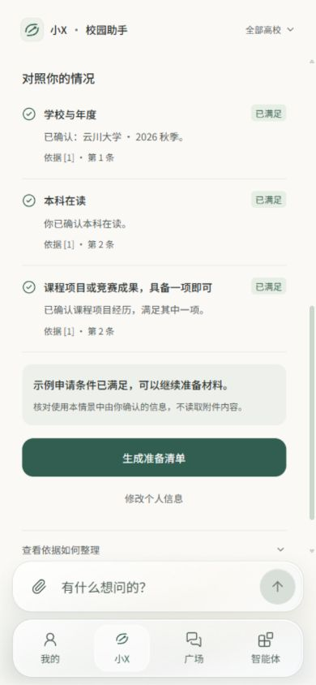
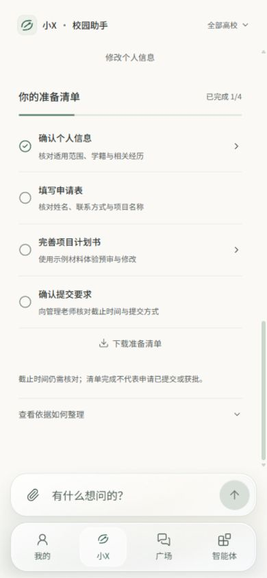
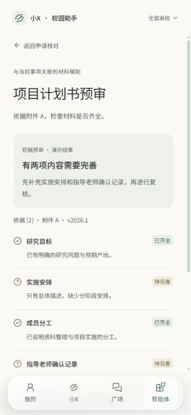

# 第三版 · 从问答到材料准备

更新日期：2026-10-06。纯前端可点击原型，全部政策与材料均为虚构示例。

## 体验路线

1. 首页点击“校内科研项目，我可以申请吗？”，发送问题。
2. 查看两份参考依据：申报说明和附件 A。点击来源可查看文件编号、版本、范围及完整条款；第一份还可打开通知全文，定位申请条件。
3. 初始三项信息均为“待确认”。点击“补充个人信息”，可逐项确认或使用一组示例信息。
4. 满足示例条件后，生成准备清单；未知信息也可保留判断并先准备。范围不匹配时，提示冲突并要求重新核对。
5. 从清单进入“项目计划书预审”。选择预设初稿，得到两项待完善的演示结果；使用修改后的示例并复核，材料进度自动更新。
6. 返回清单，手动标记申请表与提交要求的准备情况。下载清单，或从“我的 → 正在准备”继续。刷新后保留进度。

## 算法图与界面对应

| 算法关系 | 前端中的体现 | 当前边界 |
| --- | --- | --- |
| 原文、事项与规则关联 | 两份关联依据、文件编号、版本、原文条款定位 | 使用预设文件，没有入库或自动抽取 |
| 事项与个人上下文整合 | 本次申请的学校年度、在读情况、经历确认 | 与个人设置分开，不自动推断，不读取附件 |
| 混合检索、精排与父块回溯 | 短暂处理状态、可展开的流程说明、完整条款与附件 | 结果预先定义，没有运行检索模型 |
| 要求与事实对应 | 三项条件，分别展示已满足、未满足、待确认、范围冲突 | 仅对演示选择进行本地核对 |
| 证据缺口与补充 | 未知保留、表单澄清、范围冲突提示、截止时间待确认 | 没有真实补检索；不会编造截止日期 |
| 回答与下一步 | 核对结论、准备清单、关联计划书预审 | 用户选择继续；简单问答维持独立流程 |
| 任务状态回写 | 复核更新清单，当前浏览器保存，“我的”继续 | 没有远程同步、真实提交或正式审批 |

## 条件的表达

示例采用“本科在读，并且有课程项目经历或竞赛成果”的条件：两类经历具备其中一项即可。范围匹配与个人条件分别展示。

- 未知：信息尚未确认，不能视为不符合。
- 未满足：用户明确选择的演示信息与某项条件不一致。
- 范围冲突：学校或年度不一致，不能套用该文件判断资格。
- 材料齐全：修改后的预设计划书内容完整，仍不等于资格满足或申请获批。

当前演示没有额外例外条款。未来接入真实规则时，需要独立处理例外、规则版本和矛盾信息，不能仅依赖本例中的简化条件。

## 视觉处理

沿用暖白背景、深色文字、低饱和绿、系统字体与现有底部玻璃栏。来源用薄边界，条件与清单用细分隔线，状态同时有文字和图标。技术解释默认折叠，主界面按依据、核对、下一步阅读。

## 验证

严格类型、代码规范与双构建通过。11 项浏览器测试通过，覆盖原有页面、完整科研流程的 HTTP 与独立 HTML 两种模式、范围冲突、未知保留、或条件、文件名不推断资格、刷新与下载。独立 HTML 的完整流程未发出 HTTP 网络请求。

实际浏览器检查手机比例下的条件列表、补充信息面板、清单和预审页，保留桌面居中布局；真实手机软键盘仍需设备验收。
