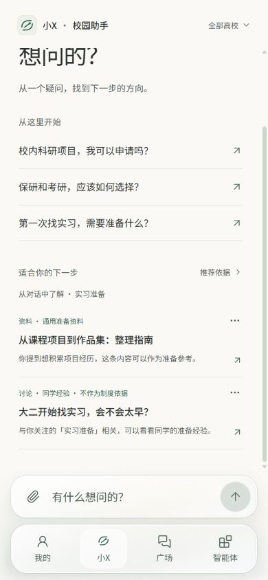
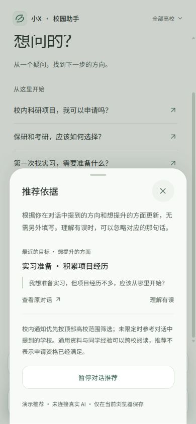

# 第四版 · 从对话自动形成推荐

更新日期：2026-10-06。学生不需要填写目标或待提升项表单。

## 已完成的体验

首页的“值得关注”替换为“适合你的下一步”。没有可用对话时先提供探索内容；聊过之后，在预设资料、通知与讨论中选取两条相关内容，优先兼顾资料与同学交流。

示例：发送“我想准备实习，但项目经历不多，应该从哪里开始？”。回到首页后，会看到项目整理指南与实习讨论。资料侧解释它如何帮助积累经历，讨论侧说明与实习准备有关。

“推荐依据”展示原话和对话入口；同一句话提取出的多个信息合并展示。学生可以忽略误解、暂停推荐，或隐藏单条内容。对话与偏好仅在当前浏览器保存。

## 如何处理信息

| 对话信息 | 处理方式 |
| --- | --- |
| 明确的个人目标，例如“我想准备实习” | 作为近期目标参与推荐 |
| 直接提问，例如“保研和考研如何选择” | 作为关注方向，不宣称长期目标已确定 |
| 本人明确提到的待提升项 | 用积极的准备方向呈现，例如“积累项目经历” |
| 明确改变目标或说某项已改善 | 更新目标或移除对应的待提升项；有限规则只能识别部分表达 |
| 朋友的情况、假设或引述 | 保守跳过相应语句，避免直接当成本人信息 |
| 附件名称、附件内容和助手回答 | 不用于个人目标或待提升项提取 |
| 学校信息 | 仅筛选校内通知范围；顶部明确选择的高校范围优先 |
| 申请条件或资格 | 与推荐独立，仍通过事项核对流程确认 |

提取只支持部分表达。当前模型保留一个近期目标与一个待提升方向，未建立完整长期画像。范围未知时，校内通知仍标明学校和“适用条件需核对”；通用资料与同学经验可以跨校阅读。没有足够相关内容时会少展示，不编造新内容。

## 结构与兼容

`src/features/recommendations` 将有限提取规则、内容目录、匹配逻辑、首页界面与资料阅读分别维护。结果从现有对话推导，不保存一份与原对话脱离的个人结论。删除对话或忽略某句话后重新计算。

新消息记录时间，以便新目标覆盖旧目标。旧版消息没有逐条时间，按对话更新时间和原有顺序近似处理；在同一旧对话中，新带时间的消息不会被旧消息覆盖。原来的收藏、资料、对话和科研准备进度继续保留，新科研讨论样例会补入已有记录。

## 视觉与验证

保留原来的首页大标题、三条快捷提问、底部输入框和玻璃导航。推荐使用细分隔线、低饱和文字与统一的箭头；每条内容右侧的轻量菜单负责反馈，不增加评分、雷达图或“缺陷”标签。手机首屏显示推荐区域，向下轻滑可完整阅读两条内容。

15 项浏览器检查通过，包括原有科研申请与普通页面、HTTP/离线推荐、资料下载、纠错、暂停、隐藏恢复、目标变化、第三人称与附件不推断、学校范围、删除对话后的重算、旧记录兼容和刷新保存。合并依据后再次通过推荐相关的 4 项检查；严格类型、代码规范与两种构建通过。

这是纯前端的有限规则演示。没有运行真实 AI 提取、语义检索或个性化排序模型；不能据此声称已理解学生所有目标，或确认其真实资格。
