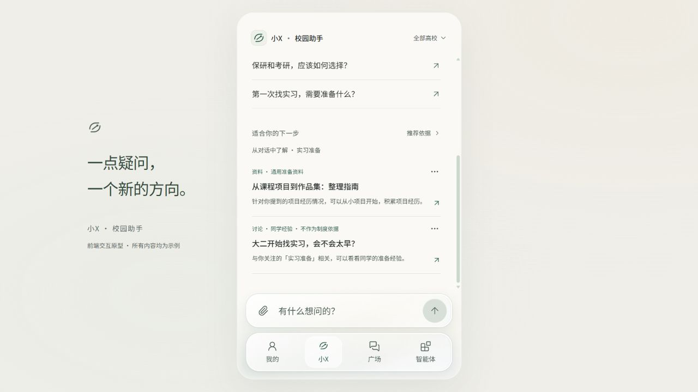

# 第二版界面优化

更新日期：2026-10-05。已根据第一版审阅落实以下改动，并在实际浏览器检查 390 × 844 手机比例与桌面居中布局。

## 已完成

- 收窄玻璃的阴影和高光，降低底部绿光饱和度；减轻选中胶囊的浮雕感。
- 移除覆盖正文的底部渐变，让个人页说明与滚动文字完整可读。
- 压缩广场重复说明与筛选间距；论坛话题概要改为可展开的一行。
- 通知首条建立更明显的阅读层级；论坛增加作者标识、日期与回复信息。
- 重组工具卡片，突出用途、适用材料与输出，并减少重复箭头。
- 加入简洁的方向标识，保留输入焦点和轻微操作反馈。
- 使用本地系统字体，并生成无需 Node.js 与网络的双击打开版。

## 视觉方向

保留温暖的浅底、深色文字和低饱和绿。高级感来自文字层级、对齐、留白、材料边界和一致的交互；科技感通过清晰的处理状态、来源引用和细腻反馈体现。玻璃集中用于底部输入栏与导航，内容区域保持安静。

## 原审阅与处理方向

| 优先级 | 当前观察 | 建议调整 |
| --- | --- | --- |
| 高 | 底部绿色光晕、圆角、高光和选中胶囊叠加，略显厚重 | 缩小阴影扩散范围，降低绿光饱和度；用更薄的亮边与局部透光表现玻璃，减轻选中胶囊的浮雕感。保留用户希望的明显玻璃质感 |
| 高 | 底部渐变淡化了个人页说明与列表尾部文字，短屏下也会影响正文阅读 | 将渐变限制在底栏附近并调整内容留白；确保滚动内容及说明完整可读。需要对实际合成背景测量对比度 |
| 中 | 广场的说明、标题、分栏、搜索、话题与高校计数占用较多首屏空间；论坛另有概要卡 | 压缩重复说明与筛选间距；论坛概要可折叠为一行，优先让同学的问题露出 |
| 中 | 通知列表条目层级较一致，重点通知辨识度不足 | 用一条重点内容与简洁的常规列表建立节奏；保留“来源—标题—摘要—时间”的清晰层级，避免每条堆放徽章 |
| 中 | 智能体大卡片较空，整体接近通用模板 | 使用更紧凑的任务卡片，明确“适用材料—输出结果—开始使用”；让工具图标与状态有统一规格 |
| 中 | 通知与学生讨论的视觉结构相近，论坛缺少人的辨识度 | 讨论加入克制的作者标识、回复信息和更新时间；通知强调发布单位与时间，两类内容保持同一套排版规则 |
| 低 | 首页气质舒展，但产品识别仍主要依靠通用星光图标 | 增加一处简洁的原创品牌符号，其他页面保持低调；名称确定后统一标识 |
| 低 | 科技感目前主要来自星光图标与绿色 | 用短暂的状态转场、输入焦点、附件进入反馈及来源定位体现智能助手感；减少装饰性星光的重复使用 |

首页保留舒展提问与底部输入。科技感主要通过精确排版、状态反馈和来源定位体现。软键盘的实际 iOS / Android 体验仍需用真实设备检查。

## 当前截图

2026-10-06：第三版沿用本页视觉方向，新增来源核对、准备清单与事项关联预审；第四版将首页通知推荐调整为对话推荐。技术过程默认折叠，正文使用薄边界和细分隔线；玻璃仍集中在底部栏。新流程见 [事项流程说明](MATTER-FLOW.md) 和 [推荐功能说明](RECOMMENDATIONS.md)。首页截图已更新，其余为第二版存档。

# v0.5.0 · 文案与说明完善

延续暖白、低饱和绿、细分隔线与底部玻璃栏。推荐理由更具体，资料增加可执行的小例子；材料预审使用对应的处理提示，不复用检索阶段文案。“推荐依据”增加恢复被忽略的依据，空推荐状态提供广场入口。页面结构与视觉风格保持一致。

详细演示说明提供 Markdown 与独立 HTML 两种阅读方式，说明本地规则、固定演示和未实现算法的区别，以及特殊输入的预期效果。历史审阅记录保留在上文。

